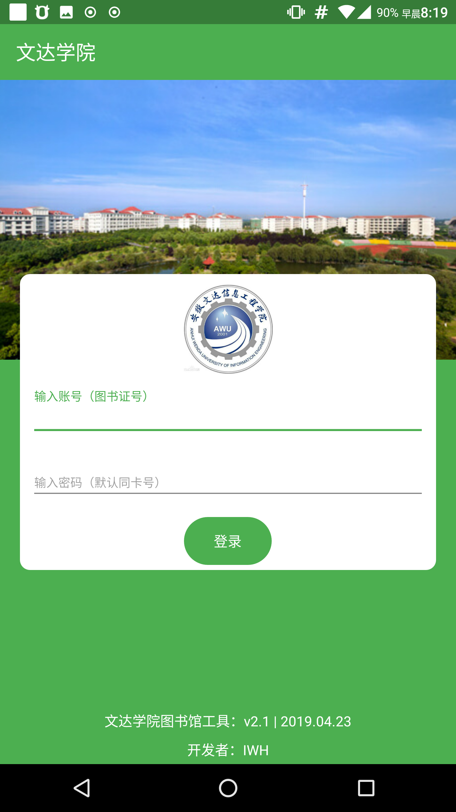
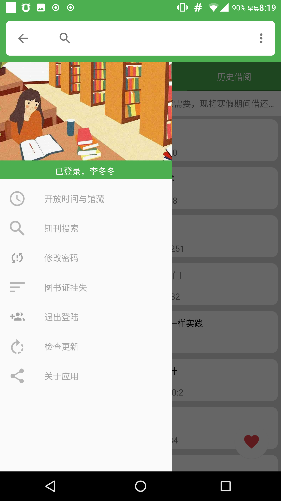
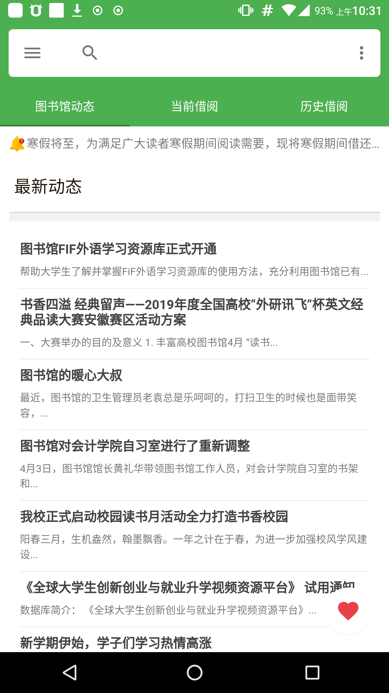
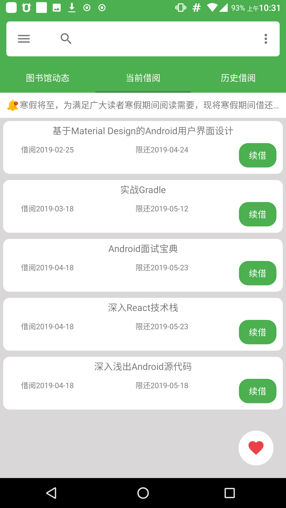
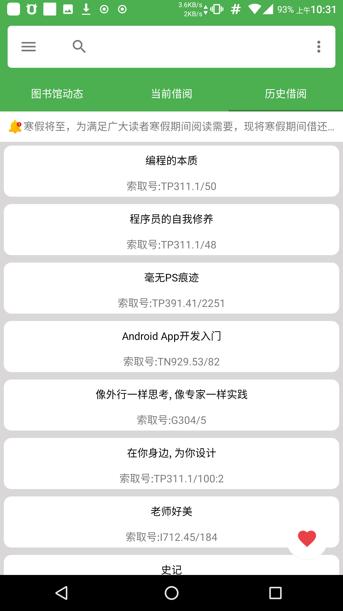

# wendaLibraryTools

技术交流群：594869854

开发者：IWH 

QQ：630020826 

TIPS:本应适配文达校园图书馆（web系统为妙思文献管理系统）

使用该web端的，基本上可以正常使用，但是由于本版本定制为文达，所以请自行修改编译：校园工具，禁止商业使用！

### 更新日志：2019.06.19 v2.3

1.增加顶部的常用网址

### 更新日志：2019.04.25 v2.2

#### 使用数据类简化部分数据

---

## CloudLibrary图书馆安卓版

### 应用采用kotlin1.3 开发。

#### 实现了，基于妙思文献图书馆系统的登录，在线续借，在线搜索，借阅历史。

#### 持久化登录状态，账户信息保留在本地。

#### 当前支持学校：文达，安外。

#### 分支：支持安信工

#### 注意：由于部分学校图书馆校园网限制，需要在校内网状态下才可以登录。

#### 该项目使用协程处理线程任务

## by：iwh  2019.04
### 预览图

